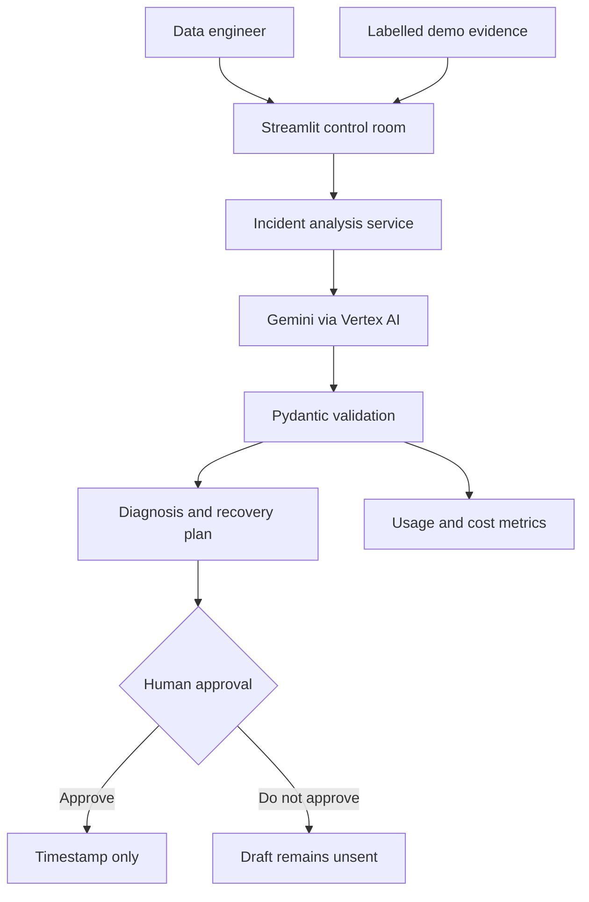

# Architecture

## Runtime flow

## Component responsibilities

| Component | Responsibility |
|---|---|
| `app.py` | Streamlit workflow, state, result presentation, and approval gate |
| `agent.py` | Vertex-mode client, evidence-bound prompt, structured Gemini call, safe errors |
| `models.py` | Pydantic contracts and input limits |
| `demo_data.py` | Editable schema drift, lineage, dashboards, and labelled preview result |
| `costs.py` | Defensive SDK usage extraction and optional Decimal cost estimate |
| `styles.py` | Compact control-room presentation |
| `tests/` | Contract, service, metrics, validation, and Streamlit workflow checks |

## Trust boundary

The only external runtime call is from the Cloud Run service to Vertex AI.
There are no stakeholder messaging or data-platform write tools. Approval is a
local session-state transition and timestamp, making the safety behaviour easy
to demonstrate and verify.

